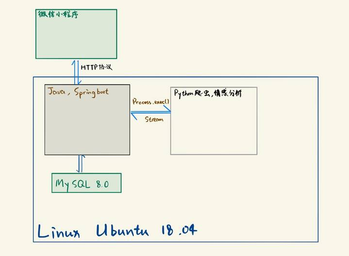

# 京东商品评价分析系统 微信小程序服务端

## 项目简介

本项目的全称是：京东商城商品评价分析系统，该系统的开发目的是为了对京东商城商品评论进行客观的、更为正确的价值分析和情感分析，为买家提供更为可信、有价值的导购意见。

## 架构设计

### 前端：微信小程序

操作系统：iOS, Android

开发工具：微信开发者工具

编程语言：Javascript, WXML, WXSS

### 服务器端：Java服务器+Python爬虫+Python情感分析模型

开发环境操作系统：Windows 10, Mac OS

生产环境操作系统：Windows 10（由于开发时间较短，目前服务端还不能部署在Linux上）

开发工具：Eclipse, Pycharm, VS Code, MySQL 8.0

编程语言：Java, Python, SQL

开发框架(Java)：SpringBoot, Mybatis plus, Lombok, shiro等

Java环境：Java SE-1.8(JDK-10.0.2), JUnit4, Maven（具体依赖参见`pom.xml`）

Python环境：Python 3.7或以上, pip 最新版（具体依赖参见`python-spider/requirements.txt` ）

数据库环境：MySQL 8.0（SQL代码在`/sql`文件夹中）

## 运行方法

### 服务端运行方法

首先，配置Python环境（Python 3.7或以上），安装好`python-spider/requirements.txt` 中的依赖。

由于项目的前后端分离，后端运行有两种方式：

1. 直接运行 `target/wechat-serverside-0.0.1-SNAPSHOT.jar`
2. 将整个项目以 Maven Project 导入 Eclipse，等待 Maven 所有依赖下载完成，运行 `src/main/java` 下的 `com.scullincw.wechatserverside.WechatServersideApplication.java`，以 Java Application 的方式运行（Maven自带了Tomcat，不需要额外配置）

### 小程序运行方法

下载 [微信开发者工具](https://developers.weixin.qq.com/miniprogram/dev/devtools/download.html)，拉取 [小程序端](https://github.com/scullincw/JD-Analysis-wechat-miniprogram) 到本地并导入，然后在微信开发者工具中编译运行。

### 数据库

数据库不需要额外部署，因为数据库已经运行在一台服务器上。如果需要自己配置，创建数据库和表的脚本在 `/sql` 中。